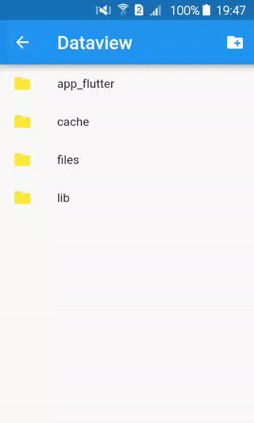

# Dataview

A file explorer for the application's documents directory.



## Usage

In a router:

   ```dart
   import 'package:dataview/dataview.dart';

   final routes = {
	// ...
	'/dataview': (BuildContext context) => new DataviewPage("/"),
	};
   ```

In a link:

   ```dart
   import 'package:dataview/dataview.dart';

   // ...
   RaisedButton(
    onPressed: () {
     Navigator.of(context).push(MaterialPageRoute(
      builder: (context) {
	   return DataviewPage("/");
      },
    ));
   },
   child: Text("View application data"))
   ```


